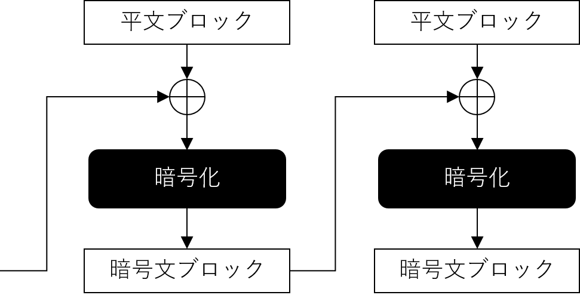
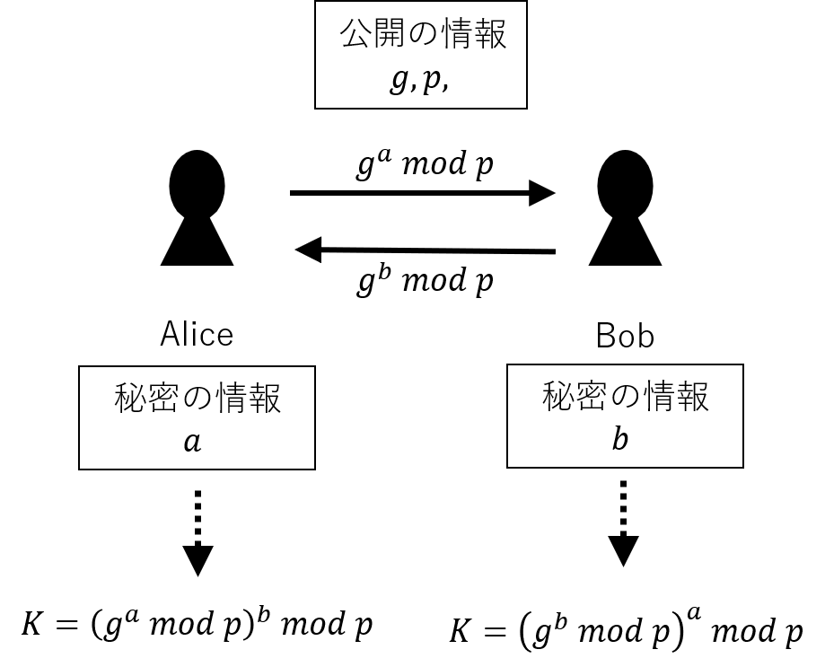

# 情報セキュリティの基盤技術「暗号」
## 概要（当初版）
暗号と認証の基本的な考え方および両者の関係，古典暗号と現代暗号の違い，現代暗号の標準化プロセス，暗号の危殆化，代表的現代暗号について述べる。TLS（https）、PKI｡　Web証明書、ソフトウェア署名。

## キーワード（当初版）
暗号、電子署名

## 概要（学習のポイント）＜改訂版＞

## キーワード＜改訂版＞

# 暗号とは
一定の規則に従って情報を秘匿する暗号方式（Cipher）は古来より広く利用されてきた。
Cipherでは情報の機密性を守るために平文（Plaintext）を鍵を用いて暗号文（Ciphertext）に変換する。
現代では情報を秘匿化するCipherだけでなく、情報通信において第3者による情報の覗き見や改ざんに対応する技術群が広くCryptographyと総称されて利用されている。
日本語ではCipherとCryptographyが共に「暗号」と訳されて混同されてしまうことがあるが、本書ではCryptographyを「暗号」と呼ぶこととし、Cipherについて言及するときは「暗号方式」と明記することとする。

本章では暗号（Cyrptography）の概要を解説する。
暗号には先述した暗号化だけではなく、署名（Signature）や鍵合意（Key Agreement）、メッセージダイジェスト（Message Digest）といった技術が含まれる。
またそういった技術の解読も暗号に含むこともある。

# 古典暗号と現代暗号の違い
## 古典暗号
暗号方式は古来より文章を秘匿化するために広く使われてきていた。
そこでは平文の文字を並び替えて暗号文を作成する転置式暗号や、特定の文字（列）を別の文字（列）に変換することで暗号文を生成する換字式暗号が主流であった。

換字式暗号では変換するルールを固定するだけでなく、変換ルール自体を暗号化とともに変化させていく方式など多くの種類の暗号が提案され使われてきていた。

最も古い暗号の1つとされるシーザー暗号は換字式暗号の一種であり、アルファベットを3文字ずらして記載することで平文を暗号文に変換していた。
この場合「3文字」が暗号鍵にあたり、暗号化は暗号鍵（3文字）の分シフトさせる作業であり、復号はその逆の作業であった。

## 現代暗号
情報の秘匿性の重要性は、情報通信の発達に伴い高まってきた。
それに従い、暗号方式もこれまでにないものが求められるようになった。
1970年代になり、米国政府が標準暗号を公募しDES（Data Encryption Standard）が作成された。
また近い時期に画期的な暗号方式のアイデアとして暗号化と復号に用いる鍵が異なる公開鍵暗号が提案された。

この時期より暗号の研究が盛んにおこなわれるようになり、さまざまな暗号技術が提案され現代の広い利用につながっていった。
本書ではこれらの時期以降の暗号を現代暗号と呼び、それ以前の暗号を古典暗号と呼ぶこととする。

現代暗号においては、暗号技術はいくつかの種類に分類される。ここでは共通鍵暗号、公開鍵暗号、暗号学的ハッシュ関数、疑似乱数生成器について解説を行う。
現代暗号にはこれら以外にも秘密分散法やゼロ知識証明、マルチパーティプロトコルなど多くの手法がある。

# 共通鍵暗号

暗号化と復号に同じ鍵を用いる暗号方式を共通鍵暗号と呼ぶ。
共通鍵暗号は、その他にも秘密鍵暗号や対称鍵暗号、慣用暗号とも呼ばれている。
また共通鍵暗号に用いられる鍵を秘密鍵（Secret Key）と呼ぶ。

共通鍵暗号は暗号化と復号に同じ鍵を用いるため、暗号文のやりとりを行う前に暗号鍵を送信者と受信者の間で共有する必要がある。
情報通信が発達したことにより非常に長距離でも情報の送受信が可能になった一方で、暗号鍵の安全な共有の困難性が増した。
後述する公開鍵暗号はこういった鍵の共有問題を解決する1つの手段として利用可能である。
共通鍵暗号は暗号鍵を共有する必要性があるとはいえ暗号文の処理速度で公開鍵暗号より優れており、現代では両者が用途に応じて使い分けがされている。

代表的な暗号アルゴリズムにはAES（Advanced Encryption Standard）がある。
AESは米国の標準技術研究所（National Institute of Standards and Technology, NIST）により2001年に定められた米国標準暗号であり、先述したDESの後継として公募された技術である。

## ブロック暗号とストリーム暗号

現代暗号における共通鍵暗号は、大きくブロック暗号とストリーム暗号に分けることができる。
暗号化を施すデータを一定のサイズで区切って暗号処理を行う方式をブロック暗号と呼び、データを1ビットまたは1バイト単位でデータストリームとして暗号化を行っていく方式をストリーム暗号と呼ぶ。
ブロック暗号の代表的な手法としてはAESが挙げられ、ストリーム暗号の代表的手法としてはChaCha20が挙げられる。

## 暗号利用モード
ブロック暗号は、そのブロック暗号の利用法を定義する暗号利用モードがあり、さまざまな利用モードを採用することでデータ秘匿化やメッセージの認証、またブロック暗号をストリーム暗号として利用することが可能になる。
代表的な利用モードには、データ秘匿化に用いられるECB（Electronic Codebook）、CBC（Cipher Block Chaining）、OFB（Output Feedback）、CFB（Cipher Feedback）、CTR（Counter）や、メッセージ認証に用いられるCCM（Counter with CBC-MAC）、GCM（Galois/Counter Mode）などがある。
データ秘匿に用いられるモードのうち、OFB、CFB、CTRはブロック暗号をストリーム暗号として利用可能にするモードとなっている。

ECBモードは最も単純な暗号利用モードであり、それぞれのブロックが独立して暗号化される（図3）。
独立して暗号化されるため、対象となるブロックの前後のデータがどういう内容であるかは関与されない。
ブロックの平文が同じであれば同じ暗号文が出てくるために、暗号文のブロック群の中に同じ内容のブロックがある場合対応する平文のブロックも同じ内容であることがわかってしまい、秘匿性に問題が生じる。
このため、ECBモードの利用は推奨されていない。

その他のモードについては、秘匿性を高めるためにブロック間に連携を持たせる工夫などがされている。たとえばCBCモードでは1つ前の暗号文ブロックと平文ブロックの排他的論理和（XOR）を計算した後に暗号化されるために、同じ平文ブロックであっても1つ前のブロックの情報により同じ暗号文ブロックになる可能性が低くなる（図4）。
CTRモードではブロックのカウンタを用意し、ブロックごとに1つずつカウンタ増加させていく。暗号ブロックは、カウンタを暗号化したものと平文ブロックをXORすることで得られる。

メッセージ認証に用いられるGCMは、認証付き暗号（Authenticated Encryption with Associated Data、AEAD）の1つであり、メッセージの暗号化だけでなく、そのメッセージの完全性と認証（Authentication）を提供する。
鍵を用いたハッシュ関数であるGHASHを用いてメッセージ認証コード（Message Authentication Code、MAC）を生成し、暗号化データとメッセージ認証コード（GCMではタグと呼んでいる）を合わせて出力する。
メッセージ認証コードにより、受信者は暗号化データが改ざんされていないかの確認と、なりすましがないことの確認ができる。

# 公開鍵暗号

暗号化と復号に異なる鍵を用いる暗号方式を公開鍵暗号と呼ぶ。
暗号化に用いる鍵を公開鍵（Public Key）と呼び、秘匿化する必要なく広く公開することが可能であることからその名称が付いた。
復号に用いる鍵を秘密鍵（Private Key）と呼び、公開鍵とは対照的に所有者本人だけが持ち秘匿化する必要のある鍵となっている。
共通鍵暗号に用いられる鍵も日本語で秘密鍵と呼ばれ混同することがあるため、プライベート鍵や私有鍵と呼ばれることもある。

## Diffie-Hellman鍵交換
DiffieとHellmanが1976年に提案した手法は、お互いの秘密の情報を相手に開示することなく情報の共有が可能なものであった。
この手法はDiffie-Hellman鍵交換（Diffie-Hellman key exchange）と呼ばれている。Diffie-Hellman鍵共有とも呼ばれるしかもこの手法は通信路の途中で第3者が通信内容を覗き見したとしてもお互いの秘密や共有される情報の計算が困難なものとなっていた。
情報の共有が可能でありながら他社による秘密の情報の導出を困難にすることの実現に、整数論における計算の困難性の1つの離散対数問題が利用された。
公開鍵暗号はこのように数学における解決困難な問題を応用して暗号技術を構成するものが多い。

Diffie-Hellman鍵交換の概要を図5に示す。

Diffie-Hellman鍵交換は通信内容を覗き見されても共有される情報が計算困難であることから、共有される情報を共通鍵暗号の鍵として利用可能にし、
情報通信の時代を迎えて困難性が高まっていた共通鍵の暗号鍵共有問題を解決することができた画期的なものであった。

## RSA
Diffie-Hellman鍵共有と同時期に、Rivest、Shamir、Adlemanの3人により暗号化と復号に異なる鍵を用いる暗号方式が提案された。
この手法は提案者らの頭文字をとりRSA暗号と呼ばれている。
RSA暗号もDiffie-Hellman鍵共有と同じく暗号の安全性実現に数学的な計算困難性を利用した。ただし離散対数問題ではなく、もう1つの整数論における代表的な計算困難性である素因数分解の問題が利用された。

RSA暗号では、誰でも利用可能な公開鍵を用いた暗号化の行為と所有者だけが利用可能な秘密鍵を用いた復号の行為が対称的に構成されており、数学的にはその順序を変えても同じ結果が得られるという特徴を持っていた。
そのため、平文に対して先に所有者だけが利用可能な秘密鍵を用いた復号行為を行い、その後に誰でも利用可能な公開鍵を用いて暗号化行為を行っても平文が復元される。この「誰でも平文が復元される」という行為は、平文が復元されたことでその前段に行われた処理が所有者しかし得ないことを確認できる行為を示すために、電子的な署名として利用することも可能となっている。
このようにRSA暗号は電子署名としても利用可能であり、その場合には所有者だけが利用可能か鍵は署名鍵、だれでも利用可能な鍵を検証鍵と呼ぶ。

## DSA
電子署名用の公開鍵暗号アルゴリズムにはその他にDSA（Digital Signature Algorithm）が広く知られている。
これはDESやAESと同様にNISTにより標準化された電子署名アルゴリズムである。
RSA暗号とは異なり、暗号用途には利用できず電子署名に特化したアルゴリズムとなっている。

またDSAの変種として、楕円曲線上の点の加算を応用して構成された楕円曲線DSA（Elliptic Curve Digital Signature Algorithm、ECDSA）も提案されており、現代ではさまざまな場面でこのECDSAが電子署名に広く利用されている。

## 公開鍵暗号の用途

公開鍵暗号の用途は、暗号化（Encryption）と鍵交換、認証、電子署名と多岐にわたる。
Diffie-Hellman鍵交換は鍵交換に特化したアルゴリズムであり、
DSAやECDSAは電子署名に特化したアルゴリズムである。
RSA暗号はこれらの中では特殊であり、暗号化や鍵交換、認証、電子署名とさまざまな用途に利用可能である。

# 暗号学的ハッシュ関数
暗号方式によるデータ秘匿は情報通信の時代において第3者に情報を覗き見されないために重要な要素であるが、
データの送受信においてはまた別の問題も存在する。

デジタル通信においてはデータの書き換えが容易であり、データそのものからは書き換えがなされたかどうかの確認が難しい。
データ送受信の途中経路で何者かが途中のデータの変更や追加、削除を行ったとしてもそれを確認することは困難となる。
そのため、信頼できる通信のためにはデータが送信時から変更がされていないかを確認できる仕組みを合わせて導入することが必要となる。

暗号学的ハッシュ関数はそういったデータの変更がなかったこと（非改ざん性）の保証が可能な技術である。

ハッシュ関数は、任意のデータを入力としてその代表的な値を出力する関数であり、暗号だけでなくデータ処理において広く利用されている技術である。
ハッシュ関数のうち暗号技術に利用するためにいくつかの安全性要件を満たした関数を暗号学的ハッシュ関数と呼ぶ。
求められる安全性要件には以下のものがある
- ハッシュ値から圧縮前のデータを復元することが困難であること（一方向性）
- あるハッシュ値と同じハッシュ値を持つ異なる入力データを見つけることが困難であること（第二原像困難性）
- 同じハッシュ値を持つ2つのデータの組を見つけることが困難であること（衝突困難性）

暗号学的ハッシュ関数の代表的なものとして、SHA-256やSHA-512がある。SHA-1やMD5といった方式も過去に広く利用されてきていたが、これまでの研究で衝突困難性が満たされないことが明らかになっており利用が推奨されなくなってきている。

暗号学的ハッシュ関数は、データ送信において送られるデータのハッシュ値計算に用いられ、そのハッシュ値はデータと共に送信される。
データ受信者は、受け取ったデータからハッシュ値を計算し、受け取ったハッシュ値と同じになるか確認することで経路途中でデータが変更されていないことを確認できる。
この用途はデータ送受信にとどまらずデータの保管においても用いられる。
また、ハッシュ値は電子署名の対象としても利用されている。公開鍵暗号による電子署名は演算時間が共通鍵暗号に比べて大きいことに加え、署名の対象となるデータはさまざまなサイズに及ぶためにまず署名対象となる元データのハッシュ値を暗号学的ハッシュ関数で求め、そのハッシュ値に対して署名が行われることが一般的である。

# 疑似乱数生成器
暗号において乱数は重要な意味を持つ。

暗号の鍵はランダム性を持つことが求められるために乱数が用いられることが一般的であり、
後述するように現代暗号はその暗号アルゴリズムは公開され、秘密にされるのは鍵だけとなっている。
鍵の情報が類推可能であった場合、暗号文のデータそのものが危険にさらされるために、鍵のランダム性は非常に重要となる。

一方で、コンピュータ等を通じて規則性や再現性のない真の乱数を生成することは困難である。
そのため、一見ランダムに見える系列を生成する疑似乱数生成器が用いられる。
疑似乱数生成器により出力されたデータ系列はアルゴリズムによっては予測可能なケースは多く、そういったアルゴリズムを用いて出力されたデータは暗号の鍵として用いるには不適切である。
そのため暗号に用いられる疑似乱数生成器はより高い要件が課せられている。

# 暗号と認証
第2章で解説した認証技術では、認証の実現に暗号技術が利用されることが多い。
たとえばパスワード認証においては、パスワードはハッシュ関数を用いてハッシュ値として保管されているがここで用いられるハッシュ関数は暗号学的ハッシュ関数が用いられる。またチャレンジレスポンスで用いられるチャレンジでは、暗号学的な疑似乱数生成器により生成されたランダムなデータが用いられる。
さらに、秘密鍵（Private Key）を用いてチャレンジに対して署名作業を行い検証をすることで認証する公開鍵暗号を用いた認証方式もあり、暗号技術は広く認証技術に採用されている。

# 現代暗号の標準化プロセス
古典暗号では秘匿されるのは暗号アルゴリズムと鍵の双方であることが多かったが、現代暗号では暗号アルゴリズムは公開され鍵だけが秘匿されることが一般的である。
こういったスタンスを指す「暗号は鍵以外の情報が公開されたとしてもなお安全でなければならない」というケルクホフスの原理が広く知られており、
米国標準として制定されてきたDESやAES、SHA-256などはアルゴリズムが公開されている中で世界中の研究者によりさまざまな検証を受けて成立されたものとなっている。
現代暗号はこのようにアルゴリズムが公開され、また一定の期間の中でさまざまな評価を受け手標準技術として選定されることが一般的となっている。

暗号技術の標準化は国際的な標準化団体における標準化と、国ごとの標準化に大別される。
国際的な標準化団体としては、ISOやITU-T、IETFなどが暗号技術の標準を定めている。

国ごとの標準化では、米国の標準が世界的に最も影響が高いといって良いだろう。
米国の標準は連邦情報処理標準（Federal Information Processing Standards、FIPS）として定められており、標準技術研究所（NIST）により発行されている。
米国の連邦政府機関及び請負業者が利用するための標準規格となっている。
多くのFIPS標準規格は、ISOやIETFなどの標準規格に採用されるなど影響力が高い。
またガイドラインの位置づけとしてSpecial Publication（SP）文書も公開されており、標準技術という位置づけではないものの同じく世界的に影響力の高い文書となっている。
日本においては、電子政府推奨暗号の安全性を評価・監視し、暗号技術の適切な実装法・運用法を調査・検討するプロジェクトであるCRYPTRECにより「電子政府における調達のために推奨すべき暗号リスト（CRYPTREC暗号リスト）」が策定されており、こちらも標準という位置づけではないもののそれに準ずる文書となっている。

多くの標準では、標準化技術として定める前に技術の公募が行われ、評価期間を経て標準技術として定められている。
代表的な例は米国における暗号技術の標準化プロセスであろう。
AESは1997年にNISTにより公募が開始され、世界中から21の方式が応募された。
応募された中から公募要件を満たす15方式が安全性や実装の性能の評価を受け、最終候補として5方式が選ばれた。
そして最終選考を経て、最終的にベルギーの研究者であるDaemenとRijmenが設計したRijndaelが2000年に採用された。

2021年2月現在、NISTは耐量子暗号（Post-Quantum Cryptography）の標準化を進めており、そこでは2016年より標準化作業が開始されて同じく公募によりアルゴリズムを募集した。暗号化、鍵交換、電子署名のそれぞれについて、量子計算機が実用化された後でも安全性の高さが望める公開鍵暗号技術が議論されている。

# 暗号を利用したセキュリティ技術
## PKI
公開鍵暗号では公開鍵を広く第三者が利用可能なようにするが、その際に「この公開鍵は、本当にその持ち主を主張するユーザの公開鍵なのか」を検証することが重要になる。
あるユーザの公開鍵をそのユーザから直接受け取ることが可能であればその検証は可能であるが、そうでないケースではなんらかの手法で公開鍵の検証を行う必要がある。

PGP（Pretty Good Privacy）では当事者間による公開鍵の交換とその保証の署名をお互いに付ける信頼の輪により公開鍵の所有者情報を検証可能にしている。
それと比して、信頼のおける機関を立て、その機関によりその公開鍵の所有者が証明される仕組みを設けて公開鍵を検証できる基盤が提案された。これが公開鍵基盤（Public Key Infrastructure、PKI）である。
信頼のおける機関は公開鍵の証明のために証明書を発行する。このとき信頼のおける機関は認証局（Certificate Authority、CA）と呼ばれ、公開鍵証明書には認証局の署名鍵により電子署名が付与される。
公開鍵証明書を受け取ったユーザは、信頼できる認証局の公開鍵を用いることでその公開鍵証明書を検証でき、その公開鍵が証明書に記載されてる（主張されている）ユーザのものであることが確認できる。

公開鍵証明書を受け取ったユーザはあらかじめ自身が信頼できる認証局を保持しておき、受け取った証明書がその信頼できる認証局やその下位認証局から発行されているかを検証する。現在の多くのOSやWebブラウザは信頼できる認証局情報があらかじめリストアップされている。

## TLS
TLS（Transport Layer Security）は暗号化だけではなく認証、メッセージ認証などセキュリティの機能を提供する機構である。特定の通信プロトコルに依存せず、組み合わせて利用することでさまざまな通信プロトコルにセキュリティ機能の提供が可能である。たとえばWebではHTTPとTLSを合わせて利用することが一般的である。電子メールの送受信プロトコルであるSMTPやPOP、IMAPでの利用も広まっている。
現在もっとも広範に利用されている暗号利用サービスと言って良いだろう。

WebでのTLS利用はWebサーバによるTLS証明書を用いてサーバ認証を行うものが一般的である。Webサーバの証明書利用はブラウザベンダの推進もあり特に広範にわたっており、ブラウザによっては信頼できるWebサーバ証明書によるTLS利用がされていない通信に関しては「保護されていない通信」といった情報が掲載されるなど、TLS利用をデフォルトとするように向かっているものもある。

## コード署名
電子署名は現在コード署名として広く使われている。これはクライアント側の端末にソフトウェアをインストールする際に、インストールするソフトウェアがOSベンダ等により正しい配付元から配付されているかどうかを検証するために用いられる。
WindowsやMac OS、Android OSやiOSなど、代表的なOSではインストールするアプリケーションに適切なコード署名がされていることが求められている。

## エンドツーエンド（E2E）暗号化
これまで通信の暗号化やそこで送受信されるメッセージの暗号化はクライアントとサーバ間でされることが主であり、サーバ側はその場合、ユーザ間で送受信されるメッセージをサーバは閲覧することが可能であった。
2010年代半ばより、暗号化と復号をユーザ間で直接行う方式が多くなってきた（多くなってきた、って表現がいいのかどうか）。サーバは暗号化にかかわらずエンドユーザ間が暗号化と復号を行うこの方式はエンドツーエンド（E2E）暗号化と呼ばれ、日本で代表的なメッセージングツールであるLINEでも採用されている。

# 研究問題

# 参考文献
[1] 結城 浩, "暗号技術入門 第3版 秘密の国のアリス", SBクリエイティブ, 2015

[2] 縫田 光司, "耐量子計算機暗号", 森北出版, 2020

[3] 黒澤 馨, "現代暗号への招待", サイエンス社, 2010

[4] W. Diffie and M. E. Hellman, "New Directions in Cryptography", IEEE Transactions on Information Theory, vol.IT-22, No.6, pp.644-654, Nov, 1976.

