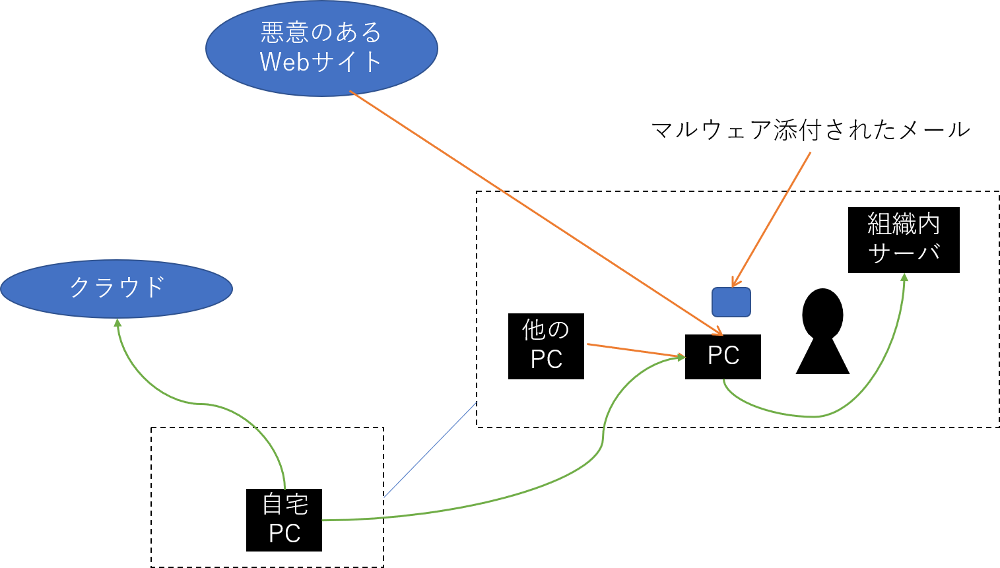

# マルウエア
## 概要（当初版）
インターネットの一般利用者の立場から、サイパー犯罪とは何かを学ぶ。次にそれらの犯罪から身を守るために、マルウェアの種類や感染経路について述べる。

## キーワード（当初版）
サイバー犯罪、マルウェア、コンピュータウイルス

## 概要（学習のポイント）＜改訂版＞

## キーワード＜改訂版＞

# サイバー犯罪とは
サイバー空間における犯罪はサイバー犯罪と呼ばれている。
明確な定義はないものの、令和2年版警察白書によるサーバー犯罪の検挙情報では以下の区分が示されている
- 不正アクセス禁止法違反
- コンピュータ・電磁的記録対象犯罪
- 児童買春・児童ポルノ禁止法違反
- 詐欺
- 著作権法違反

不正アクセスとは、他人のIDとパスワードで会員制のサイトにアクセスすることや、本来アクセス権のないコンピュータシステムに侵入することを指す。こういった不正アクセス行為を禁止する法律が「不正アクセス行為の禁止等に関する法律」（通称、不正アクセス禁止法）である。この法律では不正アクセス行為に繋がるIDやパスワードの不正取得や不正アクセス行為を助長する行為の禁止も含んでいる。

コンピュータ・電磁的記録対象犯罪は、警察白書では「刑法に規定されているコンピュータ又は電磁的記録を対象とした犯罪」と定義されている。サーバシステム等に保管されているデータを不正に書き換える行為や、クレジットカードの偽造や偽造を目的として不正に情報を取得する行為が含まれる。たとえば不正に書き換える行為では、サーバシステム上の脆弱性を悪用しアクセス制限を迂回してデータの書き換えを行うことなどが具体例としてあげられる。
また、利用者がコンピュータを利用するときに意図に沿う動作をさせない、または意図に反する動作をさせるべく不正な指令を与えることはウイルス作成・提供罪やウイルス共用罪、ウイルス取得・保管罪に問われ、これらもコンピュータ・電磁的記録対象犯罪に含まれる。

不正アクセスに関わる行為では、その多くがパスワードといった識別符号の窃用となっており、設定・管理の甘さによる不正アクセスや、他人からの入手、元従業員や知人による不正アクセスが多くを占める結果となっていた。

また不正アクセス後の行為では、インターネットバンキングでの不正送金や、インターネットショッピングでの不正購入、メールの盗み見等の情報の不正入手が多くを締め、実害を伴う被害が起きていることがわかる。

一方、不正プログラムを用いてコンピュータに侵入するなどのサイバー攻撃の脅威も多くなっている。
侵入対象が重要インフラの基幹システムや、政府機関や企業などを対象にしているものもあり、それらへの対策も重要となっている。

# マルウェア
サイバー犯罪やサイバー攻撃は、ユーザによる設定の不備など人間的側面を狙って行うものと、不正なプログラムを利用して侵入や情報の詐取を行うものに大別される。
マルウェア（Malware）とは不正な行為を行う意図で作成された悪意のあるソフトウェアの総称である。
いろいろな種類がありいくつかの視点で分類されている。
たとえばウイルスやワーム、スパイウェア、アドウェア、ボット、バックドア、ランサムウェア、などが含まれる。

## 感染経路
マルウェアはさまざまな感染経路を持つ。ここではいくつか代表的な例を紹介する（図3）。
現代のマルウェアは下記の複数の経路により感染させるものや、感染後の拡大に複数の手段を使うなど巧妙化している。

### 電子メール
電子メールにマルウェアがファイルとして添付されて、受信者が気づかずにそのファイルを実行することでその端末がマルウェアに感染するケースがこれにあたる。
このときユーザが信頼しやすい言葉が並べられるなどしてあたかも正しいメッセージであるかのように擬態し、ユーザにマルウェアの実行を促す。そのため形としては「ユーザがインストールを明示的に許可した」としてマルウェアがその端末にインストールされることとなる。

従来は電子メールに記載されている文章などは英語だけであったり、質の低い翻訳であったりするなど比較的判断が付きやすいものであったが、それらは次第に高度化してきており判断が難しくなってきている。2019年より広く感染が確認されているEmotetでは、正規にやりとりされているメール文章を利用しその返信を装って送られてくることがわかっている。また時期に応じた文面にするなど、ユーザに疑いを抱かせない手口となっている。

電子メールを介した感染では、ソフトウェアのプレビュー機能の脆弱性を狙い閲覧しただけで感染させることを狙うケースもある。

### Web閲覧
電子メールやメッセージングツール、SNSに掲載されたURLによりブラウザで悪意のあるページに誘導され、そこに掲載されている情報を見るだけで端末がマルウェアに感染するケースがある。
このケースでは主にブラウザの脆弱性が利用される。

また電子メール等のメッセージ本文にURLが記載されておりそこにアクセスするとマルウェアがダウンロードされ、ユーザが気づかずに実行することで端末がマルウェアに感染するケースもある。
このケースでは端末やメッセージングソフトウェアの脆弱性を利用するものではなく、電子メールの添付ファイルの実行と同様にURL以外の部分でユーザが信頼しやすい言葉を並べるなどして実行が促される。

### ネットワーク感染
ネットワーク通信をするソフトウェアの脆弱性を利用し感染を広げるタイプのマルウェアや、ファイル共有を利用して自身をコピーすることにより感染を広げるタイプのマルウェアが存在する。

### 外部記憶装置
あらかじめ感染している端末にUSBメモリ等の外部記憶装置が接続されると自分自身を外部記憶装置内にコピーし、その外部記憶装置が他の端末に接続した際に感染を広げさせるマルウェアが存在する。

## マルウェアの実体
マルウェアはそれ自体が単体のプログラムとして存在するケースと、他のプログラムに寄生するタイプに大別することができる。後者をウイルスと呼ぶこともある。
また前者のケースでは、無害なソフトウェアであると誤認させてインストールさせるものも存在する。

## マルウェアの種類
マルウェアはその機能によりさまざまな分類が行われる。ここではいくつかのマルウェアの種類を紹介する。
なお、それぞれの種類は厳密な用語定義や機能の分類が行われているわけではなく、慣例的に呼ばれていることが多い。
また近年のマルウェアは下記の種類の複数の機能を併せもつなど、高度化や複雑化している点も挙げられる。

### スパイウェア
スパイウェアは、端末を利用するユーザの情報などを収集し、それを情報を収集している外部の第3者に送信するソフトウェアである。
ユーザの意図に反してインストールされ、Web閲覧情報や利用しているソフトウェアの情報、さらには端末内の個人の情報を収集するなどの行為をする。

スパイウェアはさらに細分化され、キーボード入力を監視・記録してそれを外部に送信するキーボードロガーや、広告を強制的に表示させるアドウェアなどもスパイウェアと呼ばれる。

### バックドア
直訳すると「裏口」であり、その名称の通り感染したPCなどの端末に通常ではアクセスできない裏口を設け、攻撃者の侵入を導くソフトウェアである。
単体での脅威は少ないが、バックドアを通じた侵入により端末の内部にある情報が盗まれたり、その端末が接続しているネットワークを通じてさらに他の端末へと攻撃をするような用途に用いられるなどさらなる悪用につながるものである。

### ボット
感染した端末を攻撃者の管理下に置かれリモートから操作可能にされるようなソフトウェアをボットと呼ぶ。
ボットに感染した端末は同じく感染した他の端末とネットワーク化され攻撃者の指示のもとで一斉に操作されるなどの動きをする。
攻撃者が指示を行うサーバをC&C（Command and Control）サーバと呼び、ボットにより構成されたネットワークはボットネットと呼ばれる。
ボットネットは時間貸しや売買されるなど別のサイバー犯罪やサイバー攻撃に利用される。
たとえば特定の組織のサービスやシステムを狙ったDDoS攻撃や、特定の組織のWebサイトを装いユーザIDとパスワードを不正に取得するフィッシングサイトの構築、大量の広告メール送信、暗号通貨の採掘処理など、さまざまなケースが存在する。

ボットネットのC&Cサーバ追跡とその活動停止活動はテイクダウンと呼ばれ、2019年から2021年にかけて猛威をふるっていたEmotetではそのテイクダウンが過去にない大きな成功事例であるとして報告がされている。

### ランサムウェア
ランサムウェアは、感染した端末内のデータを使用不能にし普及するために金銭を要求するマルウェアである。
使用不能と復旧に暗号技術を利用することで高い脅威となっている。
感染すると端末内のデータを暗号化し使用不可にする。そして使用不可になったことをPC上に通知し、金銭を支払えば復号のための鍵とツールを提供すると伝える。
復号のための鍵はランサムウェアの提供側のサーバ側が管理し金銭の支払いによりその鍵が提供されるケースもあれば、金銭を払っても鍵が提供されないケースもあり、確実なデータ復旧が保証されているわけではない。

2013年に登場したCryptoLockerは、金銭支払いや復号のための鍵取得に高い匿名性を持っており、利用する暗号技術も公開鍵暗号を用いるなど高い技術を持っていた。
金銭の支払いも匿名性の高いシステムを利用するなど、実害が大きく攻撃者の特定も難しいマルウェアとなっている。

### ダウンローダ
ダウンローダは、他のマルウェアをダウンロードする機能を持つマルウェアである。
単体ではマルウェアとして悪意のある活動をすることはなく、他のマルウェアをダウンロードして感染させることでさまざまな攻撃を行うことを可能にする。

## マルウェア感染の影響
マルウェアに感染した端末やその利用ユーザはさまざまな影響を受ける。
現代ではダウンローダやバックドア、ボットにより感染後にさらに別の攻撃を受けることや攻撃の踏み台にされるなど複雑化しているため
影響は多岐にわたる。

感染端末やユーザのデータが盗まれることが代表的なマルウェア感染の影響であろう。
家庭利用のPCであれば、クレジットカード番号や銀行口座のアクセスIDとそのパスワード、各種サービスのIDとパスワードなどがある。
金融機関をターゲットにしたマルウェアの事例を紹介する。代表的なケースでは、マルウェアに感染したPCのユーザが金融機関の正規サイトにアクセスした時に正規のコンテンツにマルウェアが不正なHTMLを追記し、そこで認証情報の入力が求められる。ユーザがその入力を行うとそれらのデータが正規サイトではなく外部サーバに情報が送られ、認証情報が窃取される。

企業や組織利用のPCであれば、さまざまな組織内システムへのアクセスIDとパスワードや、組織内の機密情報などがある。
盗まれた情報単体で価値のあるものもあれば、その情報を用いてさらに攻撃を行うものもある。

ランサムウェアに感染した場合、データなどの情報が破壊される。
身代金を支払うことでデータ復元（復号）のための情報が提供されると提示されるもののその保証はないため、支払ってもデータの復元ができない可能性もある。

感染した端末が踏み台とされる場合もある。
ボットネットの一部としてDDoS攻撃や迷惑メールの大量送信など様々な攻撃に加担させられたり、バックドアとして組織内の他のサーバや端末などへの不正アクセスの足がかりにされたりなどする可能性がある。

## マルウェアの解析
未知のマルウェアが観測された場合、そのマルウェアがどういった動作をしどういった影響であるかを知る必要がある。
そのためにマルウェアの検体を取得し、マルウェアの解析が行われる。

マルウェアの解析技術は現在多岐に渡っているが、静的解析と動的解析に大別される。
静的解析では、マルウェアの実行ファイルをデバッグしたり逆アセンブルなどのリバースエンジニアリング手法を用いたりすることでプログラム自体を読み解く。マルウェア自体の実行を行わずに解析する静的な手法となっている。

他方、動的解析ではさまざまな観測・記録ツールによる監視状況の下で実際にマルウェアを動作させてその動作を明らかにする。
動作環境としては実際のPCの代わりに仮想化ソフトウェアを用いて仮想PCなどの環境が利用されることが多い。
さまざまなマルウェアの動的解析結果を提供するサービスも存在する。

マルウェアによっては解析を避けるために難読化の機能を持つものなどがある。またそういった難読化等の機能を提供するソフトウェア（パッカー、Packer）も存在する。

## マルウェア活動の観測
マルウェアを解析するにあたり、まずマルウェア自身を取得する必要がある。そういった解析対象の検体を取得する方法はいくつか存在するが、ここではハニーポットによる入手を紹介する。
ハニーポットとは、いわゆる「おとり」のサーバのことである。マルウェアや関連する攻撃の対象となりやすいように脆弱性があるように振る舞うように設計され、疑似的に感染させることで攻撃の活動を観測する。
その観測の一貫として、マルウェアの検体取得が行われる。

マルウェア活動の観測は、ハニーポット単体により行うこともあるが、より広範囲に観測を行っている例もある。
たとえばデータセンターや企業ネットワークの監視サービスを提供するセキュリティ企業がさまざまな監視ポイントからの情報を集約し広範囲での活動観測を行いレポートを公開することや、公的の組織により観測と分析することなど複数の事例がある。
公的な組織による観測の例としては、国立研究開発法人情報通信研究機構が開発と運用を行っているNICTERでは、未使用のIPアドレスを大規模に観測することでマルウェアを始めとしたサーバー攻撃の観測と分析を行っている。また分析結果の一部はWebを通じてリアルタイムに公開がされている。

マルウェアの活動などの分析情報や観測情報をコミュニティとして共有し、対策のための研究開発の促進や人材育成に繋げている活動もある。マルウェア対策研究人材育成ワークショップ（Anti Malware Engineering Workshop、MWS）では、複数組織から提供されたデータをデータセットとしてコミュニティに提供し、研究活動の促進が図られている。

## 標的型攻撃
古くは、マルウェアに感染した場合には感染したことが端末の利用者に明らかにわかるような動作をすることが多かった。
マルウェア作成者個人による悪ふざけや自己顕示の発露として位置づけられていたとも言われている。

時代を経て、サイバー攻撃やサイバー犯罪の道具としてマルウェアは利用されるようになってきた。「マルウェア感染の影響」にもあるように、その影響自体がある者にとっては価値のあるものとなったためである。
それに従い、マルウェアは感染の事実を隠避するようになり、またダウンローダのように感染したあとさらにその用途を変えた動きをするような自由度の高い攻撃ができるようになってきた。
感染した端末をボットネットとして多数保持しそれを貸与や売却するようなサービスも現れた。

攻撃の対象も変遷してきている。古くは不特定多数に向けて配布されてきたマルウェアは、攻撃の対象を絞り特定の組織などを狙って行われるケースが出てきた。
当初から攻撃に明確な目標と目的があり、そのためにマルウェアが利用されるケースである。こういった攻撃を標的型攻撃と呼ぶ。
企業を狙った攻撃や、政府機関を狙った攻撃などが明らかになっている。

標的型攻撃の事例として、2015年に125万件の年金情報の漏えいが発表された日本年金機構への攻撃を紹介する。
日本年金気候への標的型攻撃では、電子メールが日本年金機構を標的として送られた。これらの電子メールの内容は、組織に関連するような内容となっていた。例えば年金制度の見直しについての内容や、関連するセミナーの案内、研修関係資料などがある。
そこには添付ファイルや外部へのURLが記載されており、これらのファイルを開く（実行）することで感染し、その後の情報の流出に繋がった。

# サイバー犯罪への対策
個人がサイバー犯罪への対策として技術面で可能なことは限られてくる。
高度な攻撃を検知し適切にそれらに対応することが個人としては困難である。
一方で、利用している端末のOSやソフトウェアを最新状態にしておくことで防げる被害は大きい。
踏み台とならないことでその先の攻撃を未然に防ぐことが可能になるし、他の端末が感染していたとしても自身の端末への感染拡大を防ぐことで情報漏えいの拡大を抑えることが可能になる。技術面で個人ができる最も効果的な対策は、OSやソフトウェアを最新状態にすることと言って良いだろう。

警察白書による「検挙した不正アクセス禁止法違反に係る不正アクセス行為の犯行手口の内訳（平成30年及び令和元年）」を見ると、
「利用賢者のパスワードの設定・管理の甘さにつけこんだもの」「他人から入手したもの」「識別符号を知り得る立場にあった元従業員や知人等によるもの」などユーザのIDとパスワードが盗まれる手口の多くは技術的な面ではなく、ユーザやその組織の運用に由来するものであることがわかる。
個人としてこういったことが起きないための対策として、設定や管理手法の見直しを行うこともサイバー攻撃を防ぐことにつながる重要なポイントとなるであろう。

# 研究課題
- サイバー犯罪として検挙された事例を調査し、その傾向を見てみよう。
- 自分が標的型攻撃のターゲットとされた場合、どういう部分で模倣されたら自分は信じてしまうか、より見分ける力をつけるためにはどういう対応をすれば良いかを考えてみよう。

# 参考文献
[1] 警察庁, "令和2年版 警察白書", 2020

[2] 新井 悠, 岩村 誠, 川古谷 裕平, 青木 一史, 星澤 裕二, "アナライジング・マルウェア", オライリー社, 2010

[3] piyokango, "piyolog", はてなブログ, https://piyolog.hatenadiary.jp/

[4] 国立研究開発法人情報通信研究機構 サイバーセキュリティ研究所 サイバーセキュリティ研究室, "NICTERWEB", https://www.nicter.jp/

[5] マルウェア対策研究人材育成ワークショップ（MWS）, https://www.iwsec.org/mws/
