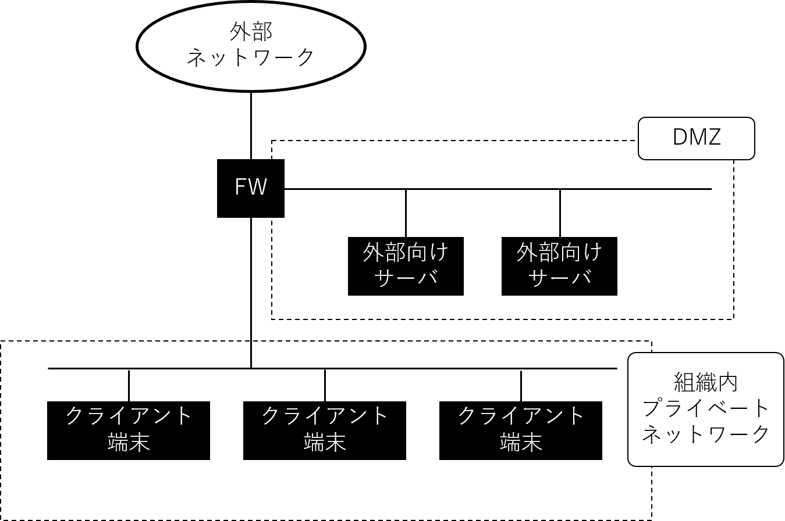

# システムとネットワークのセキュリティ
## 概要（当初版）
サーバクライアントモデル、サーバ管理の立場から、スパイウェアやインジェクションなどのサーバを攻撃する手法、大規模な組織的攻撃について述べる。また、パブリッククラウドに依存した業務の際のクラウドを使うユーザ（個人、ユーザ企業）が考えるべき情報セキュリティにや、ファイアウォールについて述べる。

## キーワード（当初版）
サーバ、クライアント、標的型攻撃

## 概要（学習のポイント）＜改訂版＞

## キーワード＜改訂版＞

# ネットワークのセキュリティ

インターネットを介してサービス提供を行うシステムが一般的なものとなっている。
エンドユーザは情報の検索や、ショッピング、動画や音楽の視聴、地図の閲覧、SNSによる交流など
さまざまな活動をインターネットを介してサービスにより行っている。

こういったサービスを提供しているシステムのセキュリティを考えるときに、
システム自身もインターネット上の端末として存在し、TCP/IP技術を用いて通信を行っていることから
ネットワークの視点でセキュリティを考えることが重要となる。

TCP/IPではネットワークは分離され、それぞれが相互に接続することによりインターネットが構成されている。
それぞれのネットワークが相互に接続する境界点に置かれる機器はルータやゲートウェイと呼ばれ、
ネットワーク内外の通信を仲立ちする。
境界点において組織内の通信と組織外からの通信を管理運用することでネットワークのセキュリティを実現するアプローチが存在する。

## ファイアウォール
TCP/IPでは、それぞれの端末はIPアドレスを持ちIP通信を行い、ポート番号により提供するサービスを変えTCP/UDP通信を行う。
Webサーバやメールサーバといったシステムは、それらの通信によりサービスを提供する。
一方でWebサーバやメールサーバは、限定された端末による外部へのサービスの提供であるため、組織内すべてのIPアドレスへすべてのTCP/UDP通信を許可する必要はない。それらのアクセスを制限することで不要な通信を抑え、不正なアクセスを防ぐことができる。

ファイアウォールはネットワークの境界点に設置されるアクセス制御の機器あるいはサービスを言う。
IPアドレスやTCP/UDPのポート番号など、通信パケットのヘッダを見てアクセス制御を行うパケットフィルタリング型や、
TCP/UDPのアクセスを代理で引き受ける通信を制御するサーキットレベルゲートウェイ型、より上位のアプリケーションレベルで挙動や内容の確認と制御を行うアプリケーションゲートウェイ型に大別することができる。
いずれも許可された通信だけを通し、許可されていない通信は遮断し管理者にその情報を通知する。

## IDS/IPS
ファイアウォールは許可された通信だけに限定することで不要な通信を防ぎセキュリティを実現するものであるが、
許可された通信に紛れて不正なアクセスがされる恐れもある。

そこで、通信内容を監視し不正アクセスを検知そして対処する機器あるいはサービスであるIDS（Intrusion Detection System、侵入検知システム）やIPS（Intrusion Prevention System）が用いられる。
IDSは攻撃を検知しその情報を管理者に通知する。IPSは、検知すると同時に通信の遮断などの防御策を講じる。

IDS/IPSが行う検知は、あらかじめ登録されている不正アクセスのパターンを用いて通信を監視しパターンと一致する通信を検知そして防御するパターンマッチング手法や、通常の通信状態を記憶しておき通常の通信とは異なる振る舞いを検知そして防御する異常（アノマリ）検知手法がある。

IDS/IPSはネットワークの境界点やその近くに設置されることでネットワーク全体の不正アクセス検知と対処をするものや、それぞれの端末に搭載されることで機器への不正アクセス検知と対処をするものがある。

## セグメントの分離

多くの組織では、組織内で従業員などが用いるPCといったクライアント端末と、組織外や組織内にサービスを提供するサーバ端末の双方を持つ。これらが同じネットワーク内に存在している場合、ファイアウォールやIDS/IPSなどを設置していたとしても一部の通信は外部から組織内に対して開かれているため、クライアント端末や組織内向けのサーバ端末に不正なアクセスが行われる可能性がある。

それらを避けるために、組織内でネットワークのセグメントを分割し、外部アクセスがある端末が置かれるセグメントと内部のクライアント端末が置かれるセグメントを設けることで不要なアクセスを制限していく方法が取られる。
このときに外部アクセスがある端末が置かれるセグメントをDMZ（DeMilitarized Zone、非武装地帯）と呼ばれる。

図4は簡単なセグメント分割を示した図である。
DMZと社内ネットワークがあり、それらの接続点にファイアウォールが置かれ通信が制御されている。

## VPN（Virtual Private Network）
VPNってなんだ。

どういう風に接続するか。
VPNルータがある。でそこにアクセスすると、組織内ネットワークに入れる。

拠点間を繋ぐタイプのVPNと、外部の端末を組織内ネットワークに接続するリモートアクセスタイプとに大別。

利用されるプロトコル：IPSec、SSL-VPN

# システムのセキュリティ
現在のインターネットを利用したシステムはサーバ1台で動いているものはほぼなく、
ファイアウォールやL2スイッチ、ルータ、ロードバランサ、Webサーバ（フロントサーバ）、アプリケーションサーバといった機能ごとの機器によりシステム用のネットワークが組まれ、1つのシステムとして稼働していることが一般的である（ほんとかね）。

## 3層構造

## 脆弱性対策
ソフトウェアの脆弱性

### バッファオーバーフロー、スタックオーバーフロー

### コンパイラによる検知
コンパイル時にコンパイラがオーバーフローを検知

### 実行負荷属性の利用
DEP、NXビット、XDビット

### メモリ空間のランダム化
ASLR

## ハードウェアによるセキュリティ
TEEの話

# 境界型防御からの移行
ファイアウォール、VPNなどセキュリティとしての機能を持たせた機器をネットワークの境界に配置しネットワークを分離して、ネットワーク内部にいる端末は無条件に信用して組織内のリソースへのアクセスを自由に許可するという情報通信を行うというケースは、いろいろと問題が出てきた。（文章が長いな）

クラウドコンピューティングとクラウドを利用したサービスの業務利用：GoogleのGsuite、Microsoft Office 365、などなど。
組織内のリソースは組織の外部ネットワークからも使えるし、そもそものリソースが組織外に置かれることも増えた。

またシステム自体もそれぞれの機器が仮想化され、クラウドにより管理・運用されるということが増えてきた。Software Defined Networkなんかはその代表例。それぞれの機器の設定を一元管理するコントロールプレーンと、コントロールプレーンからの指示により通信の制御や機器の性質を変化させるデータプレーンに分かれ、データプレーンに設置される機器は設定によりファイアウォールにもVPNサーバにもルータにも仮想的になれるというものになった。

仮想化とクラウドコンピューティングの進展は従来型のシステムに大きな変革をももたらすとともに、そのセキュリティにも変化が起こった。

これまでのネットワーク内部ならば信用し内部リソースに自由にアクセス可能するというようなモデルは通用しなくなってきた。
攻撃が高度化し、いくつかの手段を駆使して段階を踏んでネットワーク内部に侵入することもある。

境界型の防御手法だけではセキュリティの確保が難しくなってきた。

# ゼロトラストネットワーク
そこで注目されてきたのがゼロトラストネットワークという考え方である。

ゼロトラストネットワークはそれ単体で特定の技術を指すものではない。境界型防御にあるようなローカルネット内だから信じるという考えを捨て、ネットワークに信頼をおかず細かい単位でも認証と認可とデータの保護を適切に行うことでネットワークやシステムのセキュリティを確保するというものである。

認証では、利用するユーザの認証だけでなく、利用される端末を含めた認証を行う。そしてその認証に応じたリソースへのアクセス認可を行う。
端末を認証する際にセキュリティチップを使ったりすることもあるよ。いまのラップトップだと大体あるし。
TPM。PKI。

さらに進むと、端末のみならずその端末で稼働するソフトウェア・アプリケーションに対する認証と認可も考えうる。
コード署名は配付元の保証だけど、それに加えてそのソフトウェア自身の認証としてアプリケーションの内容自体やその流通経路も対象になることも今後は考えられるだろう。

# 監視
監視についても触れたほうがいいな。
各機器はいっぱいログを出す。統合的にログを集約して観測することで攻撃を含めた異常状態の監視をするよ。

またその監視を専門で行う組織を社内に作ることSOCやそれを外部委託するケースもあるよ。

またインシデント発生時の対応チームを組織内に作ることもあるよ：CSIRT。
CSIRTってどんなことするか、とか。

